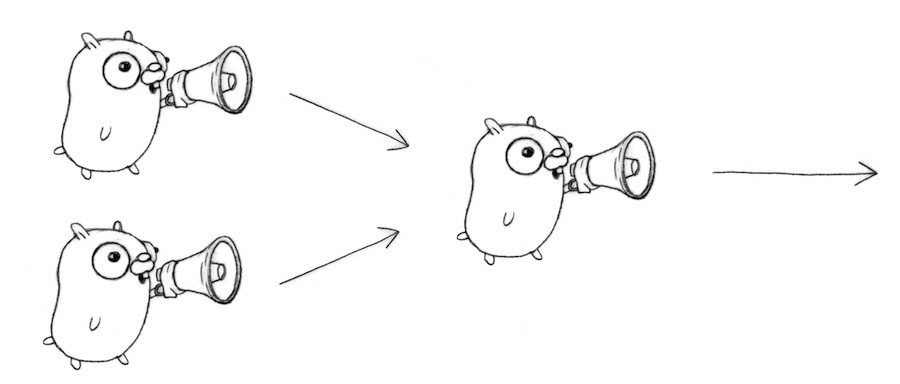

# Lab 02: Concurrency Patterns in Golang

## WaitGroups

Hopefully from the last lab we got some idea of how painful it can be managing multiple goroutines simultaneously. 
We can do it using things like time.Sleep and other blocking methods but that quickly becomes overwhelming and painful.
Fortunately there's the **sync** package which helps with that. 

Let's take a look at the following code:

```
// To wait for multiple goroutines to finish, we can
// use a *wait group*.

package main

import (
	"fmt"
	"sync"
	"time"
)

// This is the function we'll run in every goroutine.
// Note that a WaitGroup must be passed to functions by
// pointer.
func worker(id int, wg *sync.WaitGroup) {
	// On return, notify the WaitGroup that we're done.
	defer wg.Done()

	fmt.Printf("Creating Critter number %d\n", id)

	// Sleep to simulate an expensive task.
	time.Sleep(time.Second)
	fmt.Printf("Critter number %d done\n", id)
}

func main() {

	// This WaitGroup is used to wait for all the
	// goroutines launched here to finish.
	var wg sync.WaitGroup

	// Launch several goroutines and increment the WaitGroup
	// counter for each.
	for i := 1; i <= 5; i++ {
		wg.Add(1)
		go worker(i, &wg)
	}

	// Block until the WaitGroup counter goes back to 0;
	// all the workers notified they're done.
	wg.Wait()
}
```

So what's happening here? Well- let's start with the "main()" section. 
This line `var wg sync.WaitGroup` basically creates a "group" of helpers. To go back to our "guy hanging out in a room" analogy- the "waitgroup" is kind of like a bunch of uniforms that you created. SO...with a bunch of uniforms the next thing we need is...workers! Let's create FIVE of them...which we're going to do here:

```
	for i := 1; i <= 5; i++ {
		wg.Add(1)
		go worker(i, &wg)
	}
```

So now we have five workers hanging out. We assign each of them in the `worker` function. Where would this be useful? WELL...imagine if you had to go to multiple servers in order to read files or, say, `apt-get install` some stuff.  We could pass each server IP address into the function and deploy workers as necessary! 

NOW...the last section basically says "okay...we need to wait until all of these goroutines are finished"...which is a MUCH more elegant answer than using `time.Sleep` or an awkward blocking operation. Instead we simply use the command `wg.Wait()` and lo and behold...we have our blocking operation.


SO- the other thing to notice here is the order that things are coming back. Look at the output:

```
Creating Critter number 5
Creating Critter number 2
Creating Critter number 1
Creating Critter number 3
Creating Critter number 4
Critter number 5 done
Critter number 1 done
Critter number 2 done
Critter number 4 done
Critter number 3 done
```

Notice anything about the fundamentally _asynchronous_ nature of how those are put together? 
We do not control the order when using goroutines or waitgroups. The order is random (on the go playground it will always appear the same because go playground is deterministic...but if you were to run locally you would get a different order. Feel free to try it!)

So let's move on to challenge ONE:

### CHALLENGE ONE: Create a goroutine pattern that utilizes a workgroup to launch enough workers to http.GET data from three separate websites simultaneously. Print the results out to your command line. Those sites are: ["www.google.com", "www.yahoo.com", "www.imdb.com"]

## CONCURRENCY PATTERNS IN GOLANG

So let's get into concurrency patterns in Golang.

At a basic level we need to define some terms. Let's start with **Generator**. At the simplest level a GENERATOR can be defined, in golang, as a function that returns a channel. Here's a VERY basic example to run in the go playground:

```golang
package main

import (
	"fmt"
	"time"
	"math/rand"
)


func boring(msg string) <-chan string { // Returns receive-only channel of strings.
    c := make(chan string)
    go func() { // We launch the goroutine from inside the function.
        for i := 0; ; i++ {
            c <- fmt.Sprintf("%s %d", msg, i)
            time.Sleep(time.Duration(rand.Intn(1e3)) * time.Millisecond)
        }
    }()
    return c // Return the channel to the caller.
}
func main() {
    c := boring("boring!") // Function returning a channel.
    for i := 0; i < 5; i++ {
        fmt.Printf("You say: %q\n", <-c)
    }
    fmt.Println("You're boring; I'm leaving.")
}
```

Okay- so now let's create multiple instances of the service that is running...in this case that service is called "boring". So let's switch out "main" in the function above and make that work...

```golang
func main() {
    joe := boring("Joe")
    ann := boring("Ann")
    for i := 0; i < 5; i++ {
        fmt.Println(<-joe)
        fmt.Println(<-ann)
    }
    fmt.Println("You're both boring; I'm leaving.")
}
```

Okay- so we have boring (our service) creating both channels (JOE and ANN) and then we're putting those services into a loop so that each will print out in order.
So this is fine- we'll be returning to "Joe" and "Ann" shortly but for the moment please open up a SECOND go playground tab for the second example.

#### A second example on a different tab from JOE and ANN above

This is a function that takes in numbers and returns a channel to pass all of those numbers into. Pretty standard, right? 

```golang
func gen(nums ...int) <-chan int {
    out := make(chan int)
    go func() {
        for _, n := range nums {
            out <- n
        }
        close(out)
    }()
    return out
}
```

Okay- now we need a second stage (obviously- or we have simply created a system that takes numbers into a channel and eternally blocks everything). 
This function will take in the channels from the first stage (a receiving channel), square the numbers, and return them to ANOTHER "out" channel with the squared versions of the numbers.
Let's do that here:

```golang
func sq(in <-chan int) <-chan int {
    out := make(chan int)
    go func() {
        for n := range in {
            out <- n * n
        }
        close(out)
    }()
    return out
}

```

And finally our **main** function here which will run the two stages:

```golang
func main() {
    // Set up the pipeline and consume the output.
    for n := range sq(sq(gen(2, 3))) {
        fmt.Println(n) // 16 then 81
    }
}
```

So let's put these into the golang playground and see how that ends up looking...

Okay- so BASIC three stage pattern. NOW let's start looking at some other patterns that we can apply here...


### FAN OUT/FAN IN


WHAT IF we wanted to distribute work amongst a group of workers that would allow us to _parallelize_ (and remember- concurrency is not parallelism) CPU use and I/O?
In other words- what if we wanted multiple functions reading from the same channel simultaneously? 

What if we wanted to create a scenario in which the functions returned their data to us __as and when__ they were done, right? So we could have them just finishing and returning their data to us whenever 


_fan-in_ is the process by which a single function reads from multiple inputs and proceeds until all inputs are closed by multiplexing the input channels into a single channel. In it's simplest visual format:



Let's start with the simpler example. Remember "JOE" and "ANN" from above? Let's go back there and plug in this function:

```golang
func fanIn(input1, input2 <-chan string) <-chan string {
    c := make(chan string)
    go func() { for { c <- <-input1 } }()
    go func() { for { c <- <-input2 } }()
    return c
}
```
Now- what is happening here? Let's talk through that...

And then add this to main:

```golang
func main() {
    c := fanIn(boring("Joe"), boring("Ann"))
    for i := 0; i < 10; i++ {
        fmt.Println(<-c)
    }
    fmt.Println("You're both boring; I'm leaving.")
}
```

See what's happening? _At a very simple level the function **fanIn** is merging two channels together to output a single channel and then outputting as and when each are done_. 
Unfortunately this isn't as impressive here because it's fairly deterministic (goung through fanIn results in a loop). 

Let's try merging our "square root" system. Take a look at this function:

```golang
func merge(cs ...<-chan int) <-chan int {
    var wg sync.WaitGroup
    out := make(chan int)

    // Start an output goroutine for each input channel in cs.  output
    // copies values from c to out until c is closed, then calls wg.Done.
    output := func(c <-chan int) {
        for n := range c {
            out <- n
        }
        wg.Done()
    }
    wg.Add(len(cs))
    for _, c := range cs {
        go output(c)
    }
```

Now...remembering from the earlier section what the waitgroups do, take a look at what is happening here....

* The `out` channel above is our single output channel- the one that we are fanning IN to
* Sticking with that- what happens next is we create an OUTPUT function to put an input channel into our `out` channel
* We then range through the list of channels (input) into the merge function and put all of those channels into the `out` channel. We are **FANNING IN** here as each worker reports back to the main worker.
* Also (before this) we create a workgroup the size of the incoming channels list.


BUT- there's one more thing we need to add to the bottom and that's a `wg.Wait()` call (remember all of the hassle about stopping the main caller from closing before we are finished with our goroutines?)

SO...let's append this to the bottom:

```golang
    // Start a goroutine to close out once all the output goroutines are
    // done.  This must start after the wg.Add call.
    go func() {
        wg.Wait()
        close(out)
    }()
    return out
}
```

And finally, let's create our **main** as such:

```golang

func main() {
    in := gen(2,3,4,5,6,7)

    // Distribute the sq work across two goroutines that both read from in.
    c1 := sq(in)
    c2 := sq(in)

    // Consume the merged output from c1 and c2.
    for n := range merge(c1, c2) {
        fmt.Println(n) // 4 then 9, or 9 then 4
    }
}
```

Now run this in the go playground. How did this end up looking? 
Did things come in out of order? Why is that? Remember the workers....

### CHALLENGE TWO: REWRITE JOE AND ANN'S FANIN FUNCTION USING SELECT FROM MODULE ONE


#### FUTURES (PROMISES) IN GOLANG


Anyone who has done asynchronous coding in NODE.JS or any other asynchronous language is used to the concept of "promises" in code. This is asynchronous running of an item in the background with the "promise" to return the item once the main thread needs it. **THIS** is the real power of using channels in golang...essentially you can run items "in the background" and pick them up "when needed". Considering this _our first and most basic concurrency pattern is **promises**.

So in NODE you might have something like this:

```javascript
const longRunningTask = async () => {
    // Simulate a workload.
    sleep(3000)
    return Math.floor(Math.random() * Math.floor(100))
}

const r = await longRunningTask()
console.log(r)
```

Which can be rewritten in GOLANG like this:

```golang
package main

import (
	"fmt"
        "math/rand"
	"time"
)

func longRunningTask() <-chan int32 {
	r := make(chan int32)

	go func() {
		defer close(r)
		
		// Simulate a workload.
		time.Sleep(time.Second * 3)
		r <- rand.Int31n(100)
	}()

	return r
}

func main() {
	r := <-longRunningTask()
	fmt.Println(r)
}

```