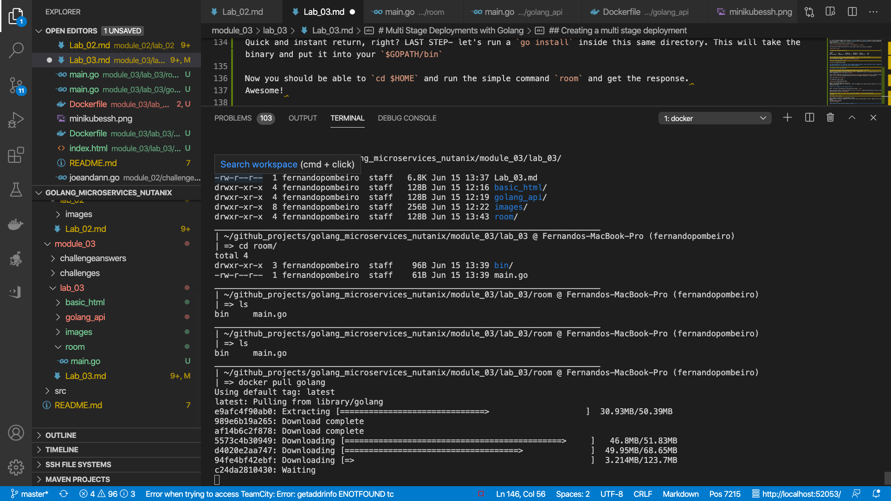
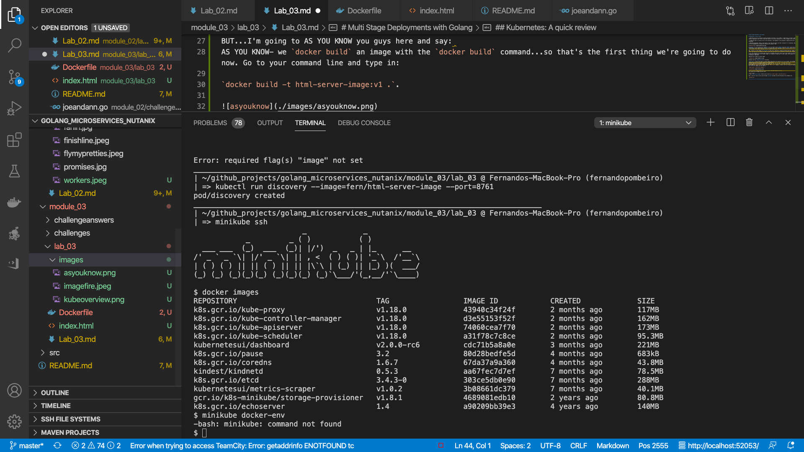

# Multi Stage and Concurrent Deployments with Golang

## Creating a multi stage deployment

Okay so we're ready to get back to GOLANG now and merge our two tutorials together. 
The first thing we need to go over is building go down to the binary. 
Hopefully by now everyone is familiar with the `go build` command and the power of building things down to the binary with a combination of `go build` and `go install`.

To do a quick review here...head into the `golang_microservices_nutanix/module_03/lab_03/room` directory. There's a basic `main.go` file here that does nothing but a print of a statement (equivalent to "Hello World").

First: do a basic `go run main.go`

You should get a basic output...


While in the same directory run `go build`.
Ideally a bin folder appears and inside that a "room" file appears. Don't bother trying to open this; it's the binary version of the file.

Now...the nice thing about GO and building down to Binary is that we can use these binaries to create virtually _any_ file type...from a windows **.exe** to a linux file (as shown) to, well...anything. It allows us to create executable files on just about any platform by manipulating the two environment variables used when we build...the **GOOS** and the **GOARCH**. 

I'm going to go ahead and put a table here that demonstrates some of the different platforms that we're able to make here to give everyone a taste (this is a useful table and worth saving)

| GOOS  - Target Operating System | GOARCH - Target Platform |
|---------------------------------|--------------------------|
| android                         | arm                      |
| darwin                          | 386                      |
| darwin                          | amd64                    |
| darwin                          | arm                      |
| darwin                          | arm64                    |
| dragonfly                       | amd64                    |
| freebsd                         | 386                      |
| freebsd                         | amd64                    |
| freebsd                         | arm                      |
| linux                           | 386                      |
| linux                           | amd64                    |
| linux                           | arm                      |
| linux                           | arm64                    |
| linux                           | ppc64                    |
| linux                           | ppc64le                  |
| linux                           | mips                     |
| linux                           | mipsle                   |
| linux                           | mips64                   |
| linux                           | mips64le                 |
| netbsd                          | 386                      |
| netbsd                          | amd64                    |
| netbsd                          | arm                      |
| openbsd                         | 386                      |
| openbsd                         | amd64                    |
| openbsd                         | arm                      |
| plan9                           | 386                      |
| plan9                           | amd64                    |
| solaris                         | amd64                    |
| windows                         | 386                      |
| windows                         | amd64                    |

So the idea here is that we can build different **kinds** of binary files depending on our needs. By default it should just work off of your local host.

The next key question here is (obviously): **What kind of computer can run a binary file?**

Let's go ahead and run the binary with a basic `./room`

Quick and instant return, right? LAST STEP- let's run a `go install` inside this same directory. This will take the binary and put it into your `$GOPATH/bin`

Now you should be able to `cd $HOME` and run the simple command `room` and get the response. 
Awesome! 

Pretty basic too, right? 

NOW...consider, if you will, the deployment in docker.
Normally when we download an image we'll have to have a bunch of other software in there, right? Let's do a quick image compare....
Run the following command:
`docker pull golang`

Please take note of how long this process is taking....



This will bring you a docker container. 
NOW run the following:
`docker pull alpine`

Okay...now run a command to take a look at the relative size of each of the docker containers that we just downloaded...

```bash
REPOSITORY                                TAG                 IMAGE ID            CREATED             SIZE
myproject/html-server-image               v1                  c4936d17f747        20 hours ago        22MB
golang                                    latest              5fbd6463d24b        5 days ago          **810MB**
alpine                                    latest              a24bb4013296        2 weeks ago         **5.57MB**
```

LOOK at the difference in sizes between the **golang** image and the **alpine** image!!

**810MB** versus **5.57MB**

That is a 99.4% savings on space!!

_Which one would you rather deploy?_
_Which one would your network rather work with??_

Okay....SO...the next logical step might seem to be to say "all right...so what we'll do from now on is build the binary manually and then deploy **that!**"

And this makes sense...BUT...we'll want to go a bit further than this! What Docker now allows us to do is a process known as a **multi-stage deployment!** 

##### Multi-stage builds are a new feature requiring Docker 17.05 or higher on the daemon and client. Multistage builds are useful to anyone who has struggled to optimize Dockerfiles while keeping them easy to read and maintain.

Basically what docker will do is the following:

* Download the appropriate DOCKER image for golang (usually the "golang" image)
* Run the `go build` command on THAT docker container
* Put the binary BACK on the host (through the mounted volume).
* Download the `alpine` image from the dockerhub
* Put the binary onto the `alpine` image
* build a new image with the 5mb `alpine` image and the basic binary code

...and we're ready to deploy!

Let's do a quick demo by doing a `cd` into our `room` directory and running 

`docker build -t fernpractice/fernimage .` 

(obviously you don't have to name your image after me)


Now let's run images again to take a look at what we have: `docker images`.

Would you LOOK at the tiny sizes of the new image here????

```bash
REPOSITORY                                TAG                 IMAGE ID            CREATED             SIZE
**fernpractice/fernimage                    latest              7d48ea74c652        22 minutes ago      7.09MB**
html-server-image                         v1                  c4936d17f747        21 hours ago        22MB
myproject/html-server-image               v1                  c4936d17f747        21 hours ago        22MB
```

Now imagine how much easier it is to DEPLOY THAT!!


## Kubernetes: A quick review

* Kubernetes runs your workload by placing containers into Pods to run on Nodes. A node may be a virtual or physical machine, depending on the cluster. Each node contains the services necessary to run Pods, managed by the control plane.

* A Kubernetes Pod is a group of one or more Containers, tied together for the purposes of administration and networking.

* Kubernetes Deployment checks on the health of your Pod and restarts the Pod's Container if it terminates. Deployments are the recommended way to manage the creation and scaling of Pods.


Essentially, for our microservices framework to work, we need to have **NODES** that have **PODS** that control **CONTAINERS**. We'll need to use **minikube** to create and run our deployment (which is how we control our containers). We're going to do a basic deployment here of a basic **image**. 

Now- _normally_ we want images in **minikube** to come from a repository. Normally minikube would pull images from a docker repo where you had pushed the image to (that repo could be aws, git, dockerhub, a private repo...wherever). 

In our case, because we're running local versions of minikube and we don't want to go to the trouble of creating accounts and repositories for our docker images, we're going to instead use our local system. This requires a tiny bit of hackiness, admittedly.

FIRST OFF let's make our initial image!


Navigate into the **module_03/lab_03** directory.

**Side note:** In bad films there's a pretty common trope where one character will say to another "AS YOU KNOW....{exposition}" as a way to explain things to the audience. 
I always hated that as obviously people don't speak like that ("As you know...red lights mean stop").
BUT...I'm going to AS YOU KNOW you guys here and say: 
AS YOU KNOW- we `docker build` an image with the `docker build` command...so that's the first thing we're going to do now. Go to your command line and type in:

`docker build -t myproject/html-server-image:v1 .`.


So now we have an image called **html-server-image** with the version **v1**. 
Let's make sure the image was built with:

`docker images`
Is your **html-server-image** there? (you can also run `docker images | grep html-server`)

Okay...now let's see if we can see the image **inside** minikube. Run the following on the command line:

`minikube ssh`



Okay...let's run `docker images` from in here and see what we see!

Do you see your **html-server-image**? 
Assuming you don't (and you shouldn't) we'll need to somehow point our docker environment to minikube...which we will do now. Let's get out of ssh with a `exit` and go back to our basic command line. 

Once we're back in our local command line let's run this command:
`eval $(minikube docker-env)`

Now- that should switch our image to allow us to build "inside minikube". Run the following to check:

`docker images`

Do you see all of the `k8s.gcr` projects now in your "local"? Excellent! We have now shifted to our environment working inside of kubernetes and we're ready to rebuild our image! 
So let's do that...

Run `docker build -t myproject/html-server-image:v1 .` again.

And again, once everything is run, let's run `minikube ssh` and see what's in there with `docker images`.

Do you see your **myproject/html-server-image** sitting there in the repository list? 
AWESOME! Now we want to switch the discovery policy as Kubernetes usually checks to pull repositories by default. `exit` from your minikube and run 

`kubectl run practicehtml --image=myproject/html-server-image --image-pull-policy=Never --port=8761`

And from here let's take a look at our pods with `kubectl get pods`

Excellent! Let's deploy this bad boy! 

`kubectl create deployment html-deployment --image=myproject/html-server-image:v1`

Okay...so we have a deployment now...let's make sure that we successfully have the deployment with the following command: `kubectl get deployments`

Do you see something that looks like this?

```bash
NAME              READY   UP-TO-DATE   AVAILABLE   AGE
html-deployment   1/1     1            1           28s

```

So...the next thing we need to do is create a **service** which will  **expose** the port to allow the deployment to run on our localhost. Remember that internally our nginx server is pointing to port 80 so we need to make sure that we expose that port.
Please run the following command to accomplish this:

`kubectl expose deployment html-deployment --type=LoadBalancer --port=80`

This should also create the service for us! Let's check to see if our service is available!

`kubectl get services`

You should see something like this: 

```bash
NAME              TYPE           CLUSTER-IP       EXTERNAL-IP   PORT(S)          AGE
html-deployment   LoadBalancer   10.101.186.119   <pending>     80:31819/TCP     38m
```

This is telling you that port 80 is exposed and mapped to 31819. This is what we want. 
Our next step is to run the service from minikube! 
Let's run using this command: `minikube service html-deployment`

Excellent! Is everything running? 

[nicework](./images/nicework.jpeg)


## Controlling Your Deployment Replications

Okay great! So we have gone over (twice) how to create and deploy basic services. Our next challenge is to **update** those services...

See- in the perfect world we would always have a steady stream of traffic coming in to our cluster at all times (1000 requests per second, let's say) and nothing would ever have to be updated.
That's the perfect world. 
Unfortunately that's not the world we live in.


Instead we need to be able to control the amount of containers running to handle different loads. 
Consider, for example, an API, right? Let's say the API runs, delivering responses to a front end game that flexes up and down depending on demand. 


So let's talk about a couple of ways that we can do this. 
The first one is directly. 
Call this the "OH *#*#!! WE NEED TO HANDLE MORE CAPACITY!!" situation....
We can run this on the command line

`kubectl scale deployments/html-deployment --replicas=2`

Now let's run again: 

`kubectl get deployments`

Have you updated to two replicas? 
Let's take a quick look at the individual pods running these:

`kubectl get pods -o wide`

Okay great! Simple! We now have two containers running, essentially doubling our capacity. Awesome. 
Let's also make sure that everything is exposed and working....
Let's start by creating an environment variable (NODE_ENV...which, if you are a `node.js` developer you're going to be familiar with this one!)

So run this:

```bash
export NODE_PORT=$(kubectl get services/html-deployment -o go-template='{{(index .spec.ports 0).nodePort}}')
echo NODE_PORT=$NODE_PORT
```

Okay- you should see your port available, right (for me it's 31819)? 
Now let's do a quick CURL to make sure that we can access our application through here:

`curl $(minikube ip):$NODE_PORT`

And if you got back HTML then **congrats!**...we're good on these.

**FYI:** The load balancer will be running and alternating the requests between two running containers. 

Let's delete everything we've made with:

`kubectl delete pod html-deployment`
`kubectl delete deployment html-deployment`
`kubectl delete service html-deployment`

### CHALLENGE ONE: Turn your single stage deployment of the basic_html into a multi-stage deployment THEN create four replicas to run concurrently.

## Auto-scaling (basic)

So...outside of the "oh S*#&!" scenario outlined above...sometimes you might want to plan for these events. Fortunately there's a relatively easy way to handle this.

[failure](./images/failure.jpg)

So let's set up a load test and win!
The first thing we'll need to do is a quick ADD ON.
Minikube has some fantastic abilities to do **add-ons** for their program (like a lot of these open source systems).
Put this into your command line:

`minikube addons list`

In order to do this next section we're going to **add-on** the metrics server by putting this statement into your command line:

`minikube addons enable metrics-server`

We can see all sorts of cool stuff available with addons 

Let's start by pulling a pre-existing php server. This is a pre-loaded php server that exists and does some basic computations in the back end.

```bash 
kubectl apply -f https://k8s.io/examples/application/php-apache.yaml
```

This is a basic php-apache image that runs a simple loop:

```php
  <?php
    $x = 0.0001;
    for ($i = 0; $i <= 1000000; $i++) {
      $x += sqrt($x);
    }
    echo "OK!";
  ?>
```

So it will run through and do some simple maths. Awesome. 
Let's run through it and add an autoscaler. 
To do that we'll run a straightforward "apply" command:

NOW we're ready to create our AUTOSCALER to allow us to autoscale this beast for when we get too many hits to the server. We do that with this command:

```bash
kubectl autoscale deployment php-apache --cpu-percent=2 --min=1 --max=10
```

We'll go over this command in class but pay particular attention to the `cpu-percent=2` section and the min/max.
It should seem pretty straightforward; basically we're saying "every time the cpu percent hits "2" let's create another container! 
OBVIOUSLY in real life we wouldn't set it that low...but we want to prove that our system works...so let's do it for demo purposes...

Let's make sure that our **Horizontal Pod Autoscaler** (or **hpa**) is set up correcty:

`kubectl get hpa`

You should see something like this:

```bash
NAME         REFERENCE               TARGETS         MINPODS   MAXPODS   REPLICAS   AGE
php-apache   Deployment/php-apache   0%/2%   1         10        1          5m59s
```

Notice that we have "unknown" or "0%" on our target there. 
WHY? 
**NO ONE IS HITTING OUR SITE YET!!**

So let's send some traffic....

Let's set up a quick vm to send TONS of requests to our internal site with a busybox vm!

`kubectl run -it --rm request-generator --image=busybox /bin/sh`

NOW...let's give this a minute of nonstop requests (are you getting a lot of "OK!"???)

`while true; do wget -q -O- http://php-apache; done`

[okay](./images/okay.png)

Now let's STOP FOR FIVE MINUTES (these things take time!)

[pencilsdown](./images/pencilsdown.png)

All right...now that 5 minutes have gone by let's see what's going on...

Okay...**open up a second bash console**

`kubectl get hpa`

You should see a % much higher than 2%. Something like....

```bash
NAME         REFERENCE               TARGETS   MINPODS   MAXPODS   REPLICAS   AGE
php-apache   Deployment/php-apache   116%/2%   1         10        10         5m37s
```

So obviously we're surging WELL above our 2% right? This would normally be an emergency. 
Let's see if we flexed up to handle all of this, bro:

```bash
NAME         READY   UP-TO-DATE   AVAILABLE   AGE
php-apache   6/10    10           6           4h16m
```

Finally- let's run a `kubectl get pods` to see all of our pods running....

[flex](./images/flex.jpg)

Okay...that should do it here. Clean up time!

Go back to your original bash console/tab and `ctl-c` to stop the `OK!OK!OK!` loop.
NOW....exit out of our virtual machine with the word `exit` That should destroy that pod. 

Now let's destroy all of our deployments and services:

`kubectl delete service php-apache`
`kubectl delete deployment php-apache`

Now that we're all cleaned up...let's move on to module 4!