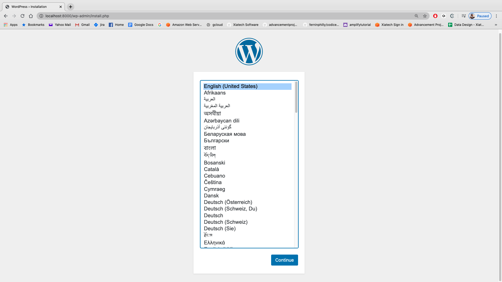
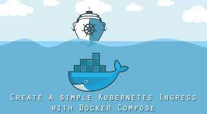

# Multi container deployments

## Docker compose and Kubernetes Kompose

So let's start with Docker Compose. The idea here is that we can do a multiple container deployment and let them all talk to each other over a network. 
Let's start with making sure that everyone has docker-compose installed! 
Go into your command line and type in `docker-compose -v`
IF you do not get back a version we'll need to install!
Head [here](https://docs.docker.com/compose/install/) to install docker-compose.


### Basic Docker Compose

Let's set up a basic Docker Compose example just to demonstrate how we network multiple containers together. 
We'll start with something that most of us are familiar with...a very basic wordpress site. 
SO- when when we create a wordpress site we need a few elements:

* a wordpress container
* a MYSQL container
* a network to allow them to talk to each other

Let's see how these look on a docker-compose yaml (head over to the **basic-docker-compose** folder)

Once you're in there you should see the docker-compose.yml folder. Let's pause here to go over each of the elements here, paying particular attention to:

* The Two Containers
* The Network
* The Volumes (which I will explain)

I'll go over this in class...

OKAY...we're ready to go. Notice that we're forwarding the port from `8000:80` in the docker-compose.yml so when we run the system we'll need to look at `localhost:8000` (not just `localhost` as we've done before).

Let's `cd` into our **/module_04/lab_04/basic-docker-compose** directory and run our `docker-compose up` (we could also do a `-d` there to run it in the background but in the short term let's just go with this version). 
Once everything is up run a `localhost:8000` in your favourite browser and you should see something like...



Now- clearly we have a MYSQL back end and a wordpress front end. If we want to see these running locally we can run `docker container ls` and we should see:

```bash
CONTAINER ID        IMAGE               COMMAND                  CREATED             STATUS              PORTS                  NAMES
9b1855635dce        wordpress:latest    "docker-entrypoint.s…"   15 minutes ago      Up 15 minutes       0.0.0.0:8000->80/tcp   basic-docker-compose_wordpress_1
07400d8eb0d9        mysql:5.7           "docker-entrypoint.s…"   15 minutes ago      Up 15 minutes       3306/tcp, 33060/tcp    basic-docker-compose_db_1
```

And we can see two containers running (including the port forwarding). 
ADDITIONALLY we can look at our network by running `docker network ls` and see the networks. Ideally you can see `basic-docker-compose_default` in this list:

```bash
NETWORK ID          NAME                           DRIVER              SCOPE
748db7eeef9e        basic-docker-compose_default   bridge              local
9e1d1c154ee1        go-docker-compose_backend      bridge              local
```

So guess what you have here??

**A DEV ENVIRONMENT!!**


So think about this...we can totally use this to develop everything from how our back end communicates with our front end to how the front end is designed!!
We can pass this `docker-compose.yml` around via github to our dev team to download and with a simple `docker-compose up` we can see an entire end-to-end environment!

Okay- let's shut everything down. 
First we need to `docker stop` both of our containers so...
Run `docker ps` and grab the container IDs then run `docker stop xxxxxx`
THEN we need to delete the containers we `docker rm $(docker ps -a -q)`

You can then clear the images with the `docker rmi` command if you'd like as well.


### Kubernetes KOMPOSE

So here we are in our dev cycle; our devs have worked tirelessly, bravely, and incredibly handsomely to create the entire system....
You have your docker-compose all set up and ready to go. 
You have your kubernetes system set up and you have created your rules around auto-scaling and deployment. 
There's one thing left to do....
Translate your docker-compose up to something that we can deploy to kubernetes. 

Fortunately there's an easy answer here: **Kompose** from Kubernetes. 



And the worse part about this (for me as an instructor anyway) is that this is an incredibly easy so there's not much to do to get everything moved into a Kompose file....

First let's get everything installed:

For mac run this in command line:

```bash
curl -L https://github.com/kubernetes/kompose/releases/download/v1.21.0/kompose-darwin-amd64 -o kompose
chmod +x kompose
sudo mv ./kompose /usr/local/bin/kompose
```

For Windows:
Download from the github site [here](https://github.com/kubernetes/kompose) and add the binary to your PATH.

Let's make sure that everything is installed by running `kompose version`

Okay...so now that we're up and running let's get a deployment ready!


I'm going to assume that we still have our **minikube** running so let's see if we can run a full deployment:

```bash
kubectl create -f db-data-persistentvolumeclaim.yaml,db-deployment.yaml,wordpress-deployment.yaml,wordpress-service.yaml
```

IF your system hangs here you might need to restart minikube with a `minikube start` and then re-run that previous kubectl create command. 
Once the deployment is done let's stop and see if everything got up there:

`kubectl get deployment`

You should get your two networked containers back:

```bash
NAME        READY   UP-TO-DATE   AVAILABLE   AGE
db          1/1     1            1           10m
wordpress   1/1     1            1           10m
```

SO...okay...we have our stuff set up. Does anyone remember how to make the deployments able to be seen from our host machines??

### CHALLENGE ONE: USING KUBECTL EXPOSE THE WORDPRESS SITE FROM MINIKUBE TO YOUR LOCAL HOST (NOTE that we want to go with port 8000) (THIS MEANS CHANGING THE DEPLOYMENT DOCUMENT). We will need to EXPOSE the LOADBALANCER


